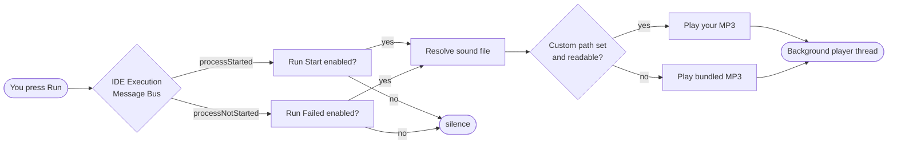

<div align="center">


# Fancy Event Sounds 🔊

**Give your IDE a voice.** A JetBrains plugin that plays a sound when something happens in your IDE — your run starts, your build breaks, your tests go green.

[](https://plugins.jetbrains.com/plugin/29305-fancy-event-sounds)
[](https://plugins.jetbrains.com/plugin/29305-fancy-event-sounds)
[](https://plugins.jetbrains.com/plugin/29305-fancy-event-sounds)
[](LICENSE)
[](https://www.jetbrains.com/idea/)
[](https://kotlinlang.org/)

[**Install**](#-installation) · [**Configure**](#-configuration) · [**Custom sounds**](#-bring-your-own-sounds) · [**Roadmap**](#-roadmap) · [**Contribute**](#-contributing)

</div>

---

## 🤔 Why does this exist?

You hit <kbd>Shift</kbd>+<kbd>F10</kbd>, then look away. Thirty seconds later you glance back and the run failed before it even started — you just lost half a minute staring at nothing.

Sound closes that loop. Your ears are always listening, even when your eyes are on Slack, the terminal, or a second monitor.

There *were* plugins that did this. They stopped being maintained and broke on modern IDEs. So this one picks up where they left off:

```
Event Sounds (2018, plugin 1243)
        └── Event Sounds (plugin 10976)
                └── Fancy Event Sounds  ← you are here
```

> [!NOTE]
> This is a maintained fork. The original work is by **Ivan Prymak** and is used here under the MIT license — see [Credits](#-credits--lineage).

---

## ✨ Features

| | Feature | Status |
|:--:|:--|:--:|
| 🚀 | **Run started** — a sound the moment a run/debug configuration launches | ✅ |
| 💥 | **Run failed to start** — instant feedback when a configuration can't launch | ✅ |
| 🎛️ | **Per-event toggles** — enable only the events you care about | ✅ |
| 🎵 | **Custom MP3s** — point any event at your own audio file | ✅ |
| 🖥️ | **Native settings UI** — lives in *Settings → Tools → Event Sounds* | ✅ |
| 🔇 | **Non-blocking playback** — audio runs off the UI thread, IDE never stutters | ✅ |
| 🧹 | **Auto-stop** — closing a project stops anything still playing | ✅ |

---

## 📦 Installation

<details open>
<summary><b>Option A — From the JetBrains Marketplace (recommended)</b></summary>

<br>

1. Open your IDE
2. Go to **Settings/Preferences** → **Plugins** → **Marketplace**
3. Search for **`Fancy Event Sounds`**
4. Click **Install**, then **Restart IDE**

Or install it straight from the web: **[plugins.jetbrains.com/plugin/29305](https://plugins.jetbrains.com/plugin/29305-fancy-event-sounds)**

</details>

<details>
<summary><b>Option B — Install from disk</b></summary>

<br>

1. Download the latest `.zip` from the [Releases page](../../releases)
2. **Settings/Preferences** → **Plugins** → **⚙️** → **Install Plugin from Disk…**
3. Pick the `.zip` (don't unzip it) → **Restart IDE**

</details>

<details>
<summary><b>Option C — Build from source</b></summary>

<br>

**Requirements:** JDK 17+, and that's it — Gradle ships with the repo.

```bash
git clone https://github.com/mordisk10/event-sounds.git
cd event-sounds

# Build the installable plugin zip → build/distributions/
./gradlew buildPlugin

# Or launch a sandbox IDE with the plugin already loaded
./gradlew runIde
```

`runIde` boots a throwaway IntelliJ instance, so you can test freely without touching your real setup.

</details>

---

## ⚙️ Configuration

Everything lives in one place:

> **Settings/Preferences** → **Tools** → **Event Sounds**

| Setting | What it does | Default |
|:--|:--|:--|
| **Play sound when Run starts** | Toggles the launch sound | ✅ On |
| **Run Start sound** | Path to a custom `.mp3`. Leave empty for the bundled sound | *(bundled)* |
| **Play sound when Run fails to start** | Toggles the failure sound | ✅ On |
| **Run Failed sound** | Path to a custom `.mp3`. Leave empty for the bundled sound | *(bundled)* |

Settings are stored **application-wide**, so they follow you across every project in that IDE.

---

## 🎧 Bring your own sounds

Click the 📂 button next to any event and pick a file.

> [!IMPORTANT]
> **Format:** `.mp3` only, for now. Playback is handled by [JLayer](http://www.javazoom.net/javalayer/javalayer.html), which doesn't decode WAV/OGG/FLAC. Multi-format support is on the [roadmap](#-roadmap).

A few things that make a sound feel *good* rather than annoying:

| Guideline | Why |
|:--|:--|
| **Keep it under ~2 seconds** | Anything longer overlaps your next action |
| **Normalize the volume** | The plugin plays the file as-is — a hot master will blow your ears out |
| **Trim leading silence** | Delay kills the "instant feedback" effect |
| **Use distinct timbres** | Success and failure should be tellable apart without thinking |

If the file you picked is missing or unreadable at play time, the plugin quietly falls back to the bundled sound instead of failing — you'll find a note in the IDE log.

**Good places to find sounds:** [Freesound](https://freesound.org/) · [Pixabay Audio](https://pixabay.com/sound-effects/) · [Zapsplat](https://www.zapsplat.com/) — check each one's license before shipping it anywhere.

---

## 🔬 How it works

The plugin hooks into the IDE's execution message bus and reacts to lifecycle events:


```mermaid
flowchart LR
    A([You press Run]) --> B{IDE Execution<br/>Message Bus}
    B -->|processStarted| C[Run Start enabled?]
    B -->|processNotStarted| D[Run Failed enabled?]
    C -->|yes| E[Resolve sound file]
    D -->|yes| E
    C -->|no| Z([silence])
    D -->|no| Z
    E --> F{Custom path set<br/>and readable?}
    F -->|yes| G[Play your MP3]
    F -->|no| H[Play bundled MP3]
    G --> I([Background player thread])
    H --> I
```

Playback happens on a dedicated thread, so a long sound never blocks the editor. Starting a new sound stops the previous one, so events can't pile up into noise.

**Project layout:**

```
src/main/kotlin/com/mordisk/eventsounds/
├── ESComponent.kt              # Subscribes to execution events, decides what plays
├── Sound.kt                    # Loads and plays an MP3 on a background thread
├── EventSoundsSettings.kt      # Persisted app-level settings (EventSoundsSettings.xml)
└── EventSoundsConfigurable.kt  # The Settings → Tools → Event Sounds screen

src/main/resources/
├── META-INF/plugin.xml         # Plugin manifest, extension points, description
└── com/mordisk/eventsounds/    # Bundled success.mp3 / error.mp3
```

---

## 🗺️ Roadmap

**Shipped**

- [x] Forked the plugin and updated the build to a modern IntelliJ Platform
- [x] Settings UI for choosing custom sounds per event — *Settings → Tools → Event Sounds*
- [x] Published to the JetBrains Marketplace

**Next up**

- [ ] **Run finished** events — success vs. failure, based on the process exit code
- [ ] **Build & compilation** sounds — the event people ask for most
- [ ] **Test run** sounds — green/red feedback from the test runner
- [ ] **VCS sounds** — commit, push, merge conflict
- [ ] **Volume slider + ▶️ preview button** in settings
- [ ] **WAV / OGG support** beyond MP3
- [ ] **Sound packs** — themed sets you can install and switch between in one click
- [ ] **Do Not Disturb** — mute everything with one toggle or on a schedule

Got an idea? [**Open an issue**](../../issues/new) — feature requests are genuinely welcome.

---

## 🤝 Contributing

PRs are open. The loop is short:

```bash
./gradlew runIde        # sandbox IDE with the plugin loaded
./gradlew buildPlugin   # produce the distributable zip
./gradlew verifyPlugin  # validate the plugin structure
```

1. Fork the repo and branch off `master`
2. Make the change — Kotlin, matching the surrounding style
3. Verify it in `runIde` against a real run configuration
4. Open a PR describing **what event you added** and **what it sounds like**

Adding a new event is usually a three-part change: subscribe to it in `ESComponent`, add its fields to `SettingsState`, and expose it in `EventSoundsConfigurable`.

---

## 🙏 Credits & lineage

| | |
|:--|:--|
| **Original author** | [Ivan Prymak](https://github.com/Essquilo) — [Event Sounds](https://plugins.jetbrains.com/plugin/10976-event-sounds) |
| **Earlier ancestor** | [Event Sounds](https://plugins.jetbrains.com/plugin/1243-event-sounds) (2018) |
| **Current maintainer** | [mordisk](https://github.com/mordisk10) |
| **Audio engine** | [JLayer](http://www.javazoom.net/javalayer/javalayer.html) by JavaZOOM |

---

## 📄 License

Released under the [MIT License](LICENSE). Original copyright © 2018 Ivan Prymak; fork maintained by mordisk.

<div align="center">
<br>

**If this plugin saved you a few glances at the run window, a ⭐ on the repo goes a long way.**

</div>
