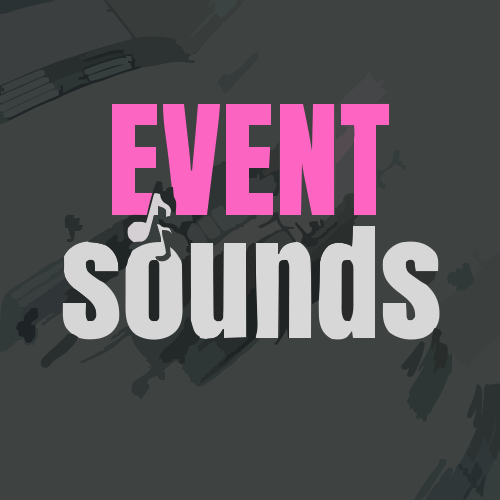

# Event Sounds 🔊

> This is a plugin for IntelliJ IDEA that plays sounds when an event occurs.

## The Problem and Alternatives
The reason i **remade this plugin** is that, I can not seem to find a plugin that does **adds sounds when an event occurs**.
  
There are some plugins achieved this, But they are **not updated** or they are **not working properly**. So i decided to **update it**.

This plugin is forked from [**this plugin**](https://plugins.jetbrains.com/plugin/10976-event-sounds) and that is the continuation of [**that plugin**](https://plugins.jetbrains.com/plugin/1243-event-sounds).

## Current State
This plugin is **not yet released**. I am working on it and i will release it as soon as possible.

## What's Left
- ✅ Forked the plugin and **updated** environment to the **latest** version.
- ❌ Create a **GUI** to add **custom** sounds for only **selected** events.
- ❌ **Publish** the plugin, add more **features**
